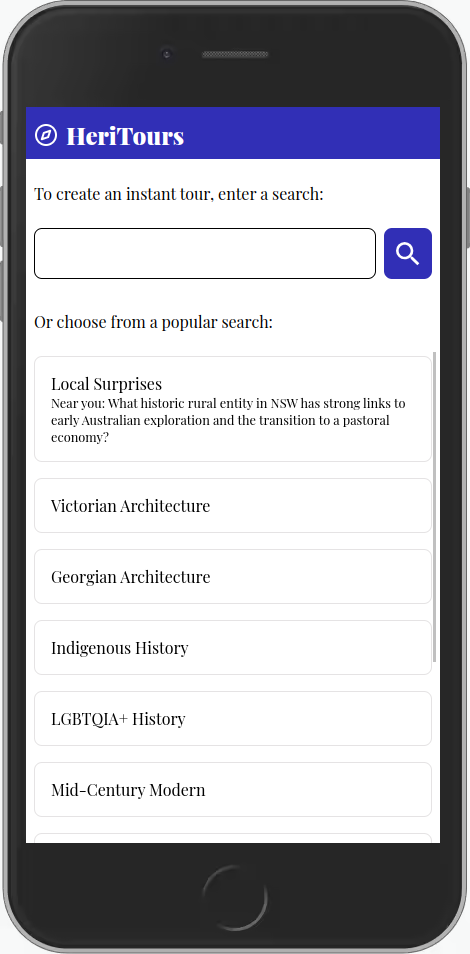
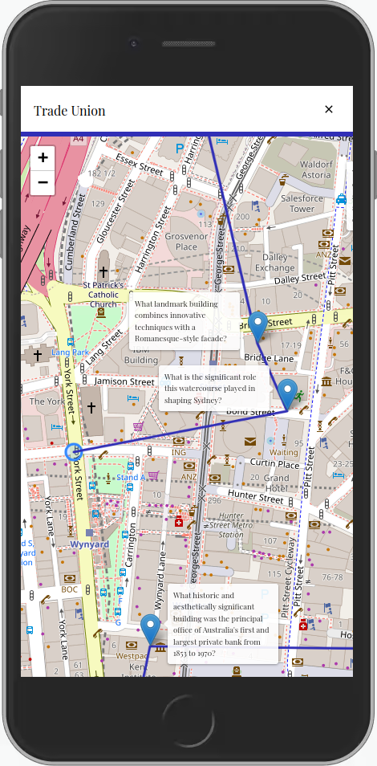
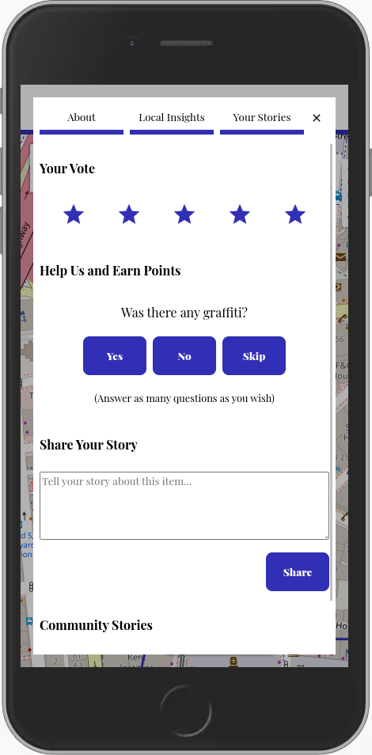

# HeriTours

HeriTours is a web-based mobile app for exploring NSW local heritage.

Noting in our demo is fake! Everything you see is real and implemented!

## Screenshots

Some sample screenshots:

## Installation Instructions

See README.md in app/

## Security 

Note that this project has not been audited for security. Please use at your own risk.

## The Technology details

*Front-end:*

- A web-based mobile front-end written in TypeScript using React, Zustand and Emotion.
- Leaflet for map visualizations.
- HTML5 Geolocation API for live position updates
- Fetch API for requests
- Fetch insights from a dashboard hosted on Tableau public, a free platform

*Back-end:*
- A Python-based server written using FastAPI and Pydantic
- An SQLite3 database to store user responses
- Dashboards designed and served by Tableau Public
- Custom shortest-path planning logic for creating a tour
- Full text search using TF-IDF based vectors from Scikit-learn

*Data-science:*
- Data manipulation using geopandas, pandas, scikit-learn
- Clues generated using free credits on OpenAI

*Data:*
- 2021 ABS Census
- NSW State Heritage Register Centroids
- NSW State Heritage Inventory
- Historic Heritage Information Management System (HHIMS)

